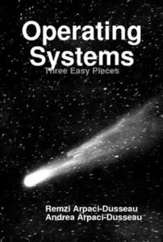

# 📘 OSTEP Study Notes

Notes and code from my study of **Operating Systems: Three Easy Pieces (OSTEP)** by Remzi & Andrea Arpaci-Dusseau.

This repository contains summaries, explanations, experiments, and implementations I wrote while learning core operating systems concepts including virtualization, concurrency, and persistence.

---

## 🎯 Goals
- Build a deep understanding of how operating systems work.
- Reinforce concepts with code (C, Java, Python).
- Document experiments from the book (e.g., CPU scheduling, threads, memory API tests).
- Practice systems programming and debugging.
- Create a personal reference I can return to later.

---

## 🧩 What’s Inside

### ✔ Chapter Notes  
Summaries of important concepts:
- Key definitions  
- Diagrams  
- Pseudocode  
- Explanations in my own words  

### ✔ Experiments  
Reproducing the book’s programs:
- CPU scheduling tests  
- Threading & race condition demos  
- Memory API exploration  
- File system behavior  

### ✔ Code  
All code examples from the book written and tested, including:
- Java translations for experiments
- Custom tests using busy waits, threads, and syscalls
